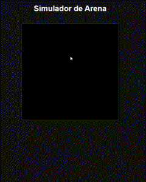

# Sand Simulator

An interactive particle simulator where sand falls and spreads under basic gravity effects. Written in JavaScript using the p5.js library.

## Demo 👉 [Try it here](https://franciscoyuster.github.io/SandSimulator/)

  

